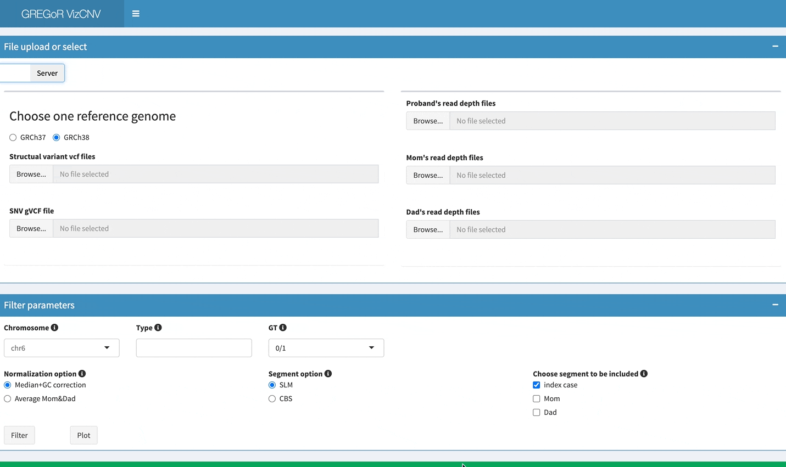
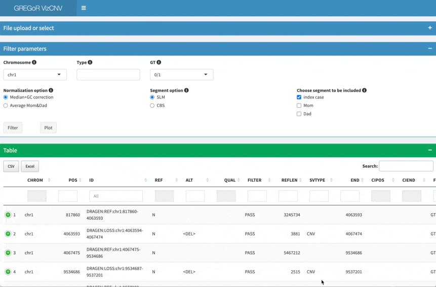

# VizCNV

This is a shiny app for chromosomal copy number variant analysis. It can
parse the vcf file with SV calls, visualize CNV and B-allele frequency
and genetic phasing information interactively.

## Prerequisites

R version \>= 3.6.3 Following R libraries are required:

Shifting level models based segmentation is performed using
[SLMSuite](https://bmcbioinformatics.biomedcentral.com/articles/10.1186/s12859-017-1734-5).

Launch app on local:

``` r
shiny::runGitHub(repo = "BCM-Lupskilab/VizCNV")
```
or launch app on local with the dev repo
``` r
shiny::runGitHub(repo = "cluhaowie/VizCNV",ref="dev-annotrack")
```


Upload the required file from local file systerm:


If launch the app on cloud or on server, input file need to be upload
due to access restriction.

Visualize the CNV calls in table format, read depth plot and B-allele
frequency together: 

The app require read depth file as the input: A output from
[mosedepth](https://github.com/brentp/mosdepth) can be used example of
generate the read depth file for 1Kb window size would be:

```{bash}
mosdepth -n --fast-mode --by 1000 sample.wgs $sample.wgs.cram
```
