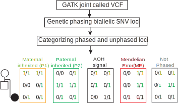

Phased_BAF
================



``` bash
git clone git@github.com:cluhaowie/VizCNV.git
cd VizCNV
chmod +x helper/Phased_BAF.R
```

## Usage and option summary

Usage:

``` bash
helper/Phased_BAF.R -I path/to/joint_genotyped.vcf -C auto
```

or:

``` bash
helper/Phased_BAF.R -I path/to/joint_genotyped.vcf -C chr1
```

| Options      | Description                                                                                                                                                                                                                                                                              |
|--------------|------------------------------------------------------------------------------------------------------------------------------------------------------------------------------------------------------------------------------------------------------------------------------------------|
| -I, –-input  | Specifies the path to a VCF file for SNP phasing and categorization. The VCF file should contain trio sample genotypes, and a joint genotyped VCF is recommended for optimal results. For joint genotyping, ref to \*\*Example Usage:\*\* \`-I path/to/joint_genotyped.vcf\`             |
| -O, –-output | Defines the path for the output file to store summarized information of each category. If no file path is provided, the information will be printed to standard output (stdout). The default behavior is to write to stdout. \*\*Example Usage:\*\* \`-O path/to/output.tsv\` (Optional) |
| -C, –-chr    | Specifies the chromosome(s) for analysis. You can specify a single chromosome with \`-C chr1\`, all chromosomes with \`-C all\`, or all autosomes with \`-C auto\`. \*\*Example Usage:\*\* \`-C chr1\`, \`-C all\`, \`-C auto\`                                                          |
| -R, –-ref    | Sets the reference genome to be used. The default reference genome is hg38. \*\*Example Usage:\*\* \`-R hg19\` (Optional; Default is \`-R hg38\`)                                                                                                                                        |
| -N, –-cores  | Determines the number of processor cores to be used for parallel processing. The default setting is 1 core. \*\*Example Usage:\*\* \`-N 4\` (Optional; Default is \`-N 1\`)                                                                                                              |

for example:

``` bash
$ helper/Phased_BAF.R
Usage: helper/Phased_BAF.R [options]
Options:
    -I CHARACTER, --input=CHARACTER
        Path to the joint genotyped VCF file

    -O CHARACTER, --output=CHARACTER
        Path to the output file

    -C CHARACTER, --chr=CHARACTER
        chr region for analysis, e.g. chr1, all, auto

    -R CHARACTER, --ref=CHARACTER
        Reference genome, e.g. hg38, hg19, [default -R hg38]

    -N CHARACTER, --cores=CHARACTER
        Number of cores for parallel analysis, [default -N 1]

    -h, --help
        Show this help message and exit
$ helper/Phased_BAF.R -I HG00405/fam1.filtered.snps.vcf.gz -C auto > fam1.phased_snp_summary.tsv
$ head -n 5 fam1.phased_snp_summary.tsv
B_InhFrom   count   total   freq    chrom
AOH_signal  214697  397205  0.540519379161894   chr1
ME  3767    397205  0.00948376782769603 chr1
Notphased   36127   397205  0.0909530343273624  chr1
fam1-2_HG00404  73751   397205  0.18567490338742    chr1
fam1-3_HG00403  68863   397205  0.173368915295628   chr1
```

## Visualization of Biallelic SNV Phasing and Categorization Metrics for Trio Samples: HG00405 (Child), HG00404 (Mother), HG00403 (Father) on Autosomes

``` r
library(ggplot2)
library(dplyr)
snp_stats <- data.table::fread("fam1.phased_snp_summary.tsv")
style_rd <- theme_classic()+
  theme(plot.title = element_text(face = "bold", size = 12),
        legend.position = "top",
        legend.title = element_text(colour="black", size=12),
        legend.text = element_text(size = 12),
        panel.border = element_blank(),
        panel.grid.minor.y = element_blank(),
        panel.grid.minor.x = element_line(linetype = 4,colour = "grey85"),
        panel.grid.major.y = element_line(linetype = 5,colour = "grey70"),
        panel.grid.major.x = element_line(linetype = 5,colour = "grey50"),
        panel.background = element_blank(),
        axis.text.y = element_text(color = "black", size = 10),
        axis.text.x = element_text(color = c("black"), size = 10),
        axis.title = element_text(color = "black", size = 12),
        axis.ticks = element_line(color = "black"))
nchr <- length(unique(snp_stats$chrom))
colored_cat <- unique(snp_stats$B_InhFrom)
names(colored_cat) <- c("black","red", "#999999", "#E69F00","#39918C")
F1_snps <- snp_stats%>%
  group_by(B_InhFrom)%>%
  summarise(aver_freq=round(mean(freq),2),
            sd_ratio=sd(freq),
            total=sum(count))%>%
  mutate(se=sd_ratio/sqrt(nchr),
         lower_ci=aver_freq-qt(0.975,df=100-1)*se,
         upper_ci=aver_freq+qt(0.975,df=100-1)*se)%>%
  ggplot(.,aes(x=B_InhFrom,y=aver_freq,fill=B_InhFrom))+
  geom_col()+
  geom_errorbar(aes(ymin=lower_ci,ymax=upper_ci,width=.5))+
  geom_text(aes(label=aver_freq),vjust = -0.8)+
  ylim(0,1)+
  style_rd+
  theme(axis.text.x = element_text(angle = 45, vjust = 1,hjust = 1),
        axis.title.x = element_blank())+
  scale_fill_manual(breaks = colored_cat, 
                    values=names(colored_cat))
F1_snps 
```

<!-- -->
